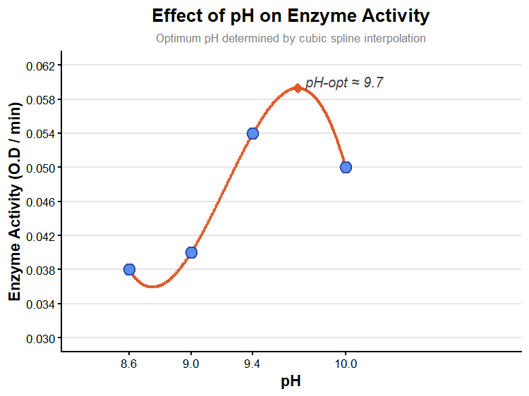

# pH_optima_ALP
pH effects the structure and activity of enzymes. It can effect the state of ionization of acidic or basic amino acids. This can lead to altered protein recognition or an enzyme might become inactive. So determination of pH optima by experimental observation and computational tools is so important in enzyme related industries and research.
# Enzyme pH Optimum Curve Estimation using R

An R-based solution to plot and determine the optimum pH of an enzyme using cubic spline interpolation. This project bypasses rigid linear models to model realistic biological curvature, dynamically identifying the exact peak of enzymatic activity.


---

## 🔬 Scientific Context
Enzymes exhibit optimal activity within a narrow pH range. Deviations from this optimum can alter the ionization states of amino acid residues at the active site or lead to denaturation. 

Because experimental data points are often discrete, this script applies a **cubic spline interpolation** (`spline()`) to simulate a continuous, smooth activity curve. It then algorithmically extracts the absolute mathematical peak to pinpoint the dynamic **pH optimum ($pH_{opt}$)**.

---

##  Script Features
* **Cubic Spline Interpolation:** Smoothes discrete lab data points into a continuous kinetic curve ($n = 500$).
* **Automated Peak Detection:** Automatically detects the precise coordinates of maximum enzyme activity.
* **Publication-Quality Plotting:** Uses `ggplot2` with customized breaks, clear color-coding, and automatic peak annotation.

---
---

##  Visualized Output

The generated plot displays a clean curve highlighting your experimental points alongside the mathematically derived dynamic peak:




* **Blue Circles:** Raw experimental O.D. values.
* **Orange Line:** Spline-interpolated kinetic trend.
* **Orange Diamond:** Calculated dynamic maximum peak ($pH_{opt} \approx 9.7$).

---

##  How to Run the Analysis

The core logic is stored entirely within the standalone script [`pH_optima.R`](./pH_optima.R). You can execute the analysis directly from your R environment or terminal.

### 1. Run via RStudio / Console
### 1. Install Required Package

```r
install.packages("ggplot2")
```
###  Experimental Dataset

| pH | Enzyme Activity (O.D.) |
| :---: | :---: |
| 8.6 | 0.038 |
| 9.0 | 0.040 |
| 9.4 | 0.054 |
| 10.0 | 0.050 |

### 2. Run the Script

```r
source("pH_optima.R")
```

### Output

Running the script generates:

- A pH optima curve
- Identification of optimum pH
- Publication-style visualization

### Limitations:

* **Interpolation Artifacts**: Splines assume a highly localized mathematical smoothness. If experimental data points are sparse or noisy, the spline can overfit the noise or generate unnatural "wobbles" (Runge's phenomenon) that do not reflect true biological behavior.
* **Lack of Mechanistic Basis**: This approach is purely empirical and descriptive. Unlike mechanistic models (e.g., calculations based on the Michaelis-Menten framework at varying pH or the Michaelis-Davidsohn equation), this model does not calculate the specific $pK_a$ values of the catalytic amino acid residues.
* **Buffer Interference**: The model assumes the observed drop in activity is due entirely to pH. In real laboratory settings, shifting pH requires changing the buffer system (e.g., switching from Tris to Glycine-NaOH), which can introduce confounding ion effects on enzyme stability or substrate binding.

### Future Improvements:

* **Mechanistic pH-Rate Modeling**: Transitioning from empirical splines to non-linear regression using the diprotic ionization model to extract exact active-site pka values.
* **Confidence Interval Bootstrapping**: Implementing bootstrapping techniques to calculate a statistical confidence interval around the predicted pH optima, rather than just outputting a single point estimate.
* **Multi-temperature Integration**: Expanding the dataset into a 3D response surface model to analyze the synergistic effects of temperature and pH on enzyme structural stability simultaneously

## Project Structure
 
```
.
├── pH_optima.R   # Main analysis script
└── README.md     # Project documentation
└── pH_optima_plot    #plot generated              
```
 
---
 
## Author
 
**Arunabha Pal**
BSc Microbiology
_St. Xavier's College (Autonomous) Kolkata_

